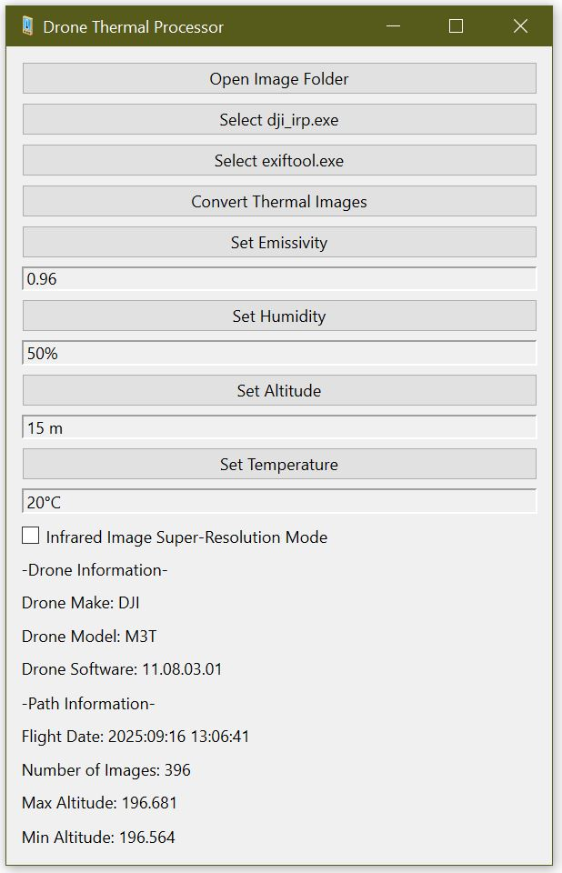

# DJI M3T Thermal Converter
DJI Mavic drones save thermal images in a thermogram format. This format is not compatible with photogrammetry pipelines (e.g., Agisoft Metashape, Pix4D).
This GUI application offers simple and efficient way to calibrate your M3T thermal images and convert them to .tif format. 

# Usage
1. Download required software. 
2. Rename "exiftool(-k).exe" to "exiftool.exe".
3. Open folder of DJI M3T thermal images
4. Select dji_irp.exe from thermal sdk (\dji_thermal_sdk_v1.7_20241205\utility\bin\windows\release_x64\dji_irp.exe)
5. Select exiftool.exe
6. Set Emissivity, Humidity, Altitude and Temperature
7. Select "Convert Thermal Images". It will first ask you for an export folder to save the images.

# Notes
- The UI looks ugly.
- Currently tested on the DJI M3T images. 
- This application automatically transfers all RTK and flight information!
- Only enable "Infrared Image Super-Resolution Mode" if you know your images are captured in this mode.

# Known Issues
- It does not check if your input settings are misconfigured! Limited error handing.

# Requires
- ExifTool Windows executable (https://exiftool.org/index.html)
- DJI Thermal SDK (https://www.dji.com/ca/downloads/softwares/dji-thermal-sdk)